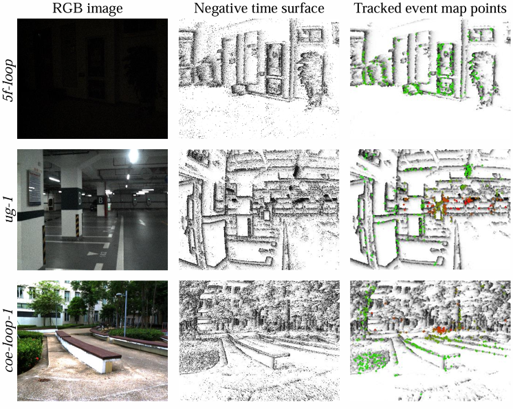
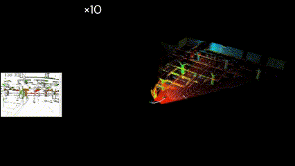
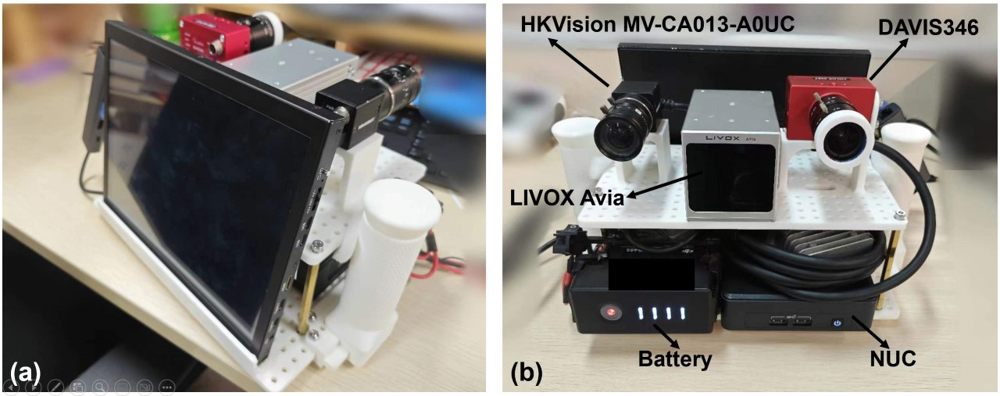
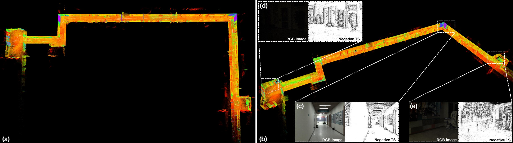
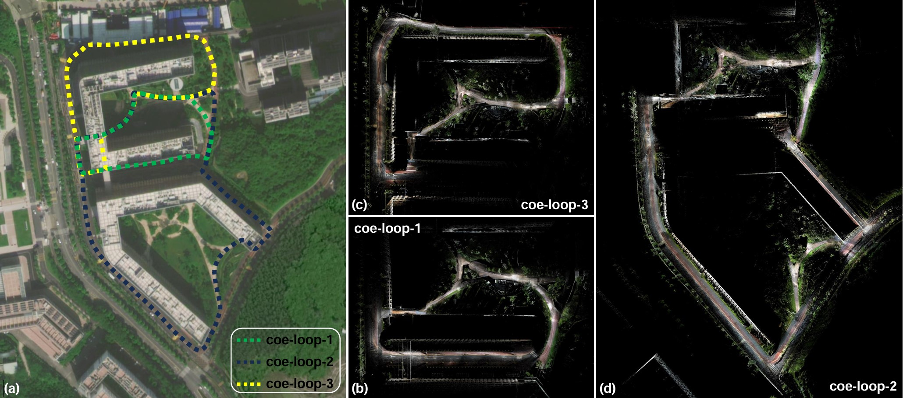

# FAST-LIEO

The code and dataset will be available after paper review.

FAST-LIEO is designed to fuse measurements of LiDAR, IMU and event camera, supporting both LIEO and LIEVO (with standard RGB camera input).

    
    

### Our [LIE dataset]():

    
     
    Platform

    
     
    Indoor

    
     
    Outdoor

